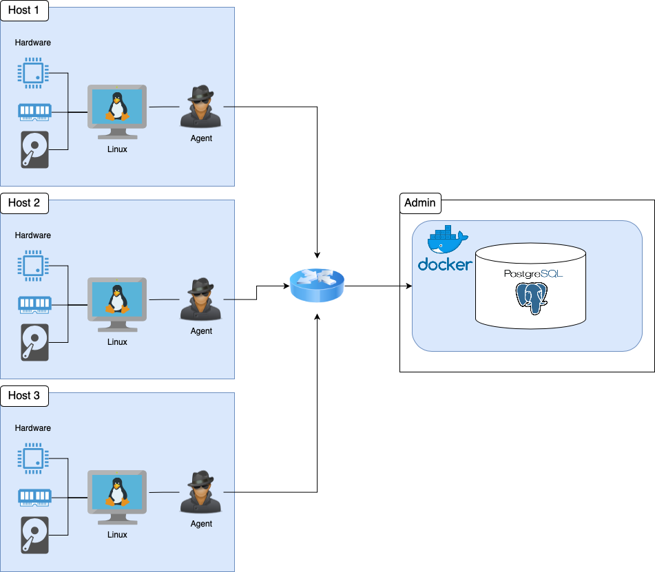

# Linux Cluster Monitoring Agent
# Introduction
The project objective is to develop an MVP Linux Cluster Monitoring Agent that records each node's hardware specifications and resource usage. The project will help the administration team in decisions regarding allocating resources. The system is deployed in a docker container and includes a Postgres database in which the node's information are stored in two tables, CentOS servers instantiated in google cloud, and the bash scripts that fetch the nodes' input. Crontab is scheduled to run a bash script that collects the node's information while the system is active.
# Quick Start
````bash
# Create and run a psql instance
./scripts/psql_docker.sh create [username] [password]

# Create the tables
export PGPASSWORD=[password]
psql -h localhost -U [username] -c "CREATE DATABASE host_agent;"
psql -h localhost -U [username] -d host_agent -f ./sql/ddl.sql

# Insert hardware specs data into the database
./scripts/host_info.sh localhost 5432 host_agent [username] [password]

# Insert hardware usage data into the database
./scripts/host_usage.sh localhost 5432 host_agent [username] [password]

# Crontab setup
crontab -e
# Add this in your crontab file
* * * * * bash /global/path/to/host_usage.sh localhost 5432 host_agent postgres password > /tmp/host_usage.log
````
# Implementation
The project includes below steps:
1. Setup GitHub repository: This step includes setting up a GitHub repo with a series of branches. The branches are master, release, develop, and feature branches.
2. Docker container: `psql_docker.sh` creates a Postgres database container of image postgres:9.6-alpine and can start and stop the container.
3. Database and tables: data is stored in a Psql database. The `ddl.sql` file creates two tables under the host_agent database to store hardware specification and resource usage information.
4. Fetch information: `host_info.sh` and `host_usage.sh` scripts fetch their local node information and issue a SQL query to record data into their relevant database table.
5. Automate the monitoring: the Cron table is scheduled through the crontab command to run the `host_usage.sh` script every minute.
# Architecture
Note:  Please note that although the diagram depicts a scenario where a switch connects multiple hosts, the implementation of this project involved only one host device.


# Scripts
- `psql_docker.sh`: This script accepts three arguments. Depending on the first argument, decides to create a container (if it does not exist) or start/stop the available container.
- `host_info.sh`: The script takes five arguments (host, port, database name, user, password) and issues an insert statement to the host_info table.
- `host_usage.sh`: Same as `host_info.Sh`, it takes five arguments (host, port, database name, user, password) and issues an insert statement to the host_usage table.
- `ddl.sql`: It creates two tables under the host_agent database in Psql. host_info records the hardware information, and the host_usage records the node usage data.
# Database Modeling
Note: all columns are Not NULL and the tables are created under default Public schema.

`host_info` schema
Field Name | Data Type |
---------- | --------- |
id | SERIAL INT |
hostname | VARCHAR |
cpu_number | INT |
cpu_architecture | VARCHAR |
cpu_model | VARCHAR |
cpu_mhz | INT |
l2_cache | INT |
total_mem | INT |
timestamp_ | TIMESTAMP |


`host_usage` schema
Field Name | Data Type |
---------- | --------- |
host_id | SERIAL INT |
memory_free | NUMERIC |
cpu_idle | INT |
cpu_kernel | INT |
disk_io | INT |
disk_available | INT |
timestamp | TIMESTAMP |
# Test
- `psql_docker.sh` was manually executed through the command line to create the Psql docker container on an already instantiated CentOS server on Google cloud. The container status was verified by the command docker container inspect jrvs-psql.
- `ddl.sql` was manually executed through the command line to create the required tables. The tables were verified by Selecting query on tables after connecting to the database.
- `host_info.sh` was manually executed through the command line to gain data and records into the relevant Psql table through an insert statement. Select query on host_info table showed the successful result.
- `host_usage.sh` was executed automatically through the scheduled Cron table every minute. The result was verified by the select the query on the host usage table.
# Deployment
The project was deployed on an already instantiated CentOS server on Google cloud. GitHub, Docker, and Crontab were the primary applications and tools used to deploy the application. Most Git actions took place directly in the Linux CLI terminal. IntelliJ was used an IDE in this project. The Psql docker container pulled from the DockerHub repository was created through a bash script.
# Improvements
- Detect hardware changes and runs the `host_info.sh` script if a change is detected.
- Make some triggers on table host_usage to send an alarm if resource usage exceeds the limitation.
- Make visual reports for analytical purposes.


